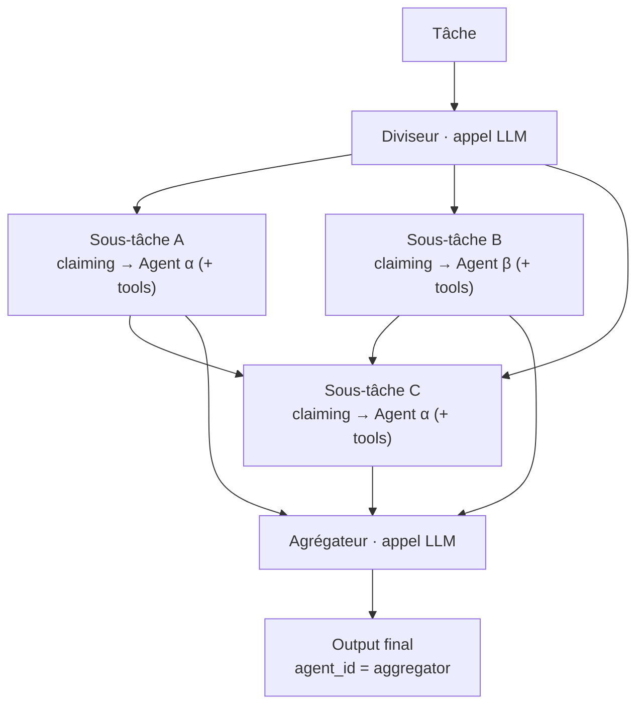
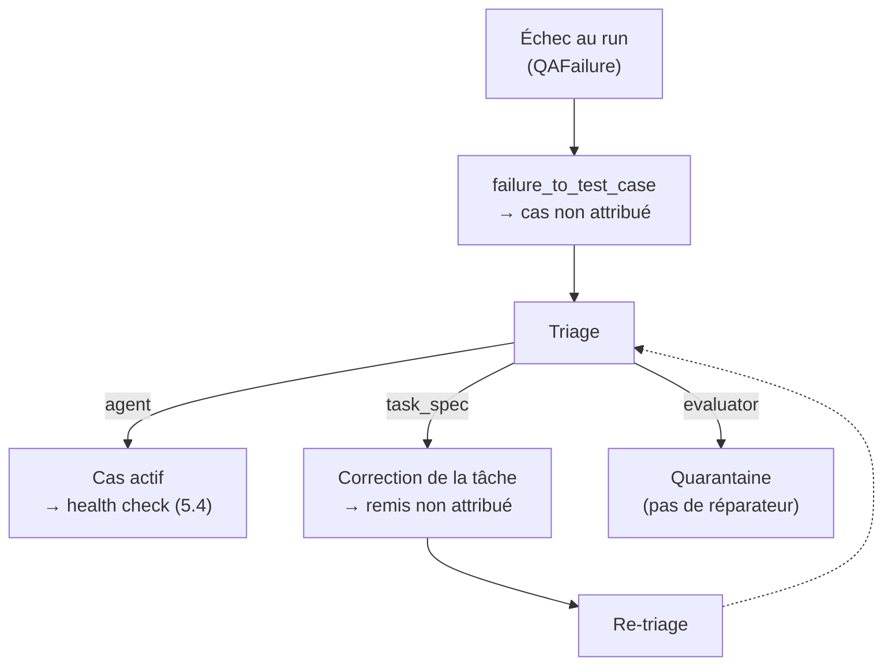
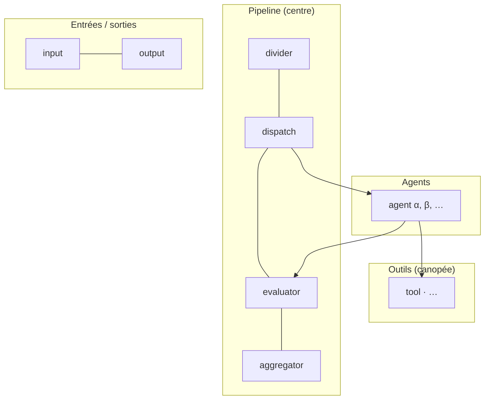

# universal-AAOSA — Documentation technique

_Runtime multi-agents à coordination bottom-up par claiming. Le graphe d'exécution émerge des décisions distribuées des agents : il n'est pas connu à l'avance._

---

## 1. Le problème

Un système multi-agents classique repose sur un **orchestrateur central**. Un composant unique reçoit la tâche, décide quel agent la traite, route les sous-tâches, recolle les résultats. Le graphe d'exécution (qui parle à qui, dans quel ordre) est défini d'avance, dans le code de l'orchestrateur.

Cette architecture a quatre limites structurelles.

- **Point de défaillance unique.** L'orchestrateur connaît tous les agents et porte toute la logique de routage. C'est à la fois le goulot d'étranglement et le composant le plus fragile : sa panne arrête le système, sa complexité grandit avec chaque agent ajouté.
- **Plafond d'autonomie.** Le système ne peut traiter que les cas que l'orchestrateur a anticipés. Une tâche qui ne rentre pas dans un chemin prévu n'a pas de route. L'intelligence du système est plafonnée par celle de son routeur, pas par celle de ses agents.
- **Couplage fort.** Ajouter, retirer ou spécialiser un agent oblige à retoucher le routage central. Les agents ne sont pas des unités autonomes : ce sont des fonctions appelées par un chef d'orchestre qui doit tout savoir d'eux.
- **Graphe figé.** La topologie d'exécution est une décision de conception, prise avant le premier run. Elle ne s'adapte pas à la tâche réelle. Un problème qui gagnerait à être découpé différemment ne le sera pas : le découpage est câblé en amont.

Le constat de fond : dans ce modèle, l'orchestrateur **est** l'intelligence du système, et les agents sont des exécutants. Plus on veut d'autonomie, plus l'orchestrateur doit être complexe, et plus il devient le facteur limitant.

**La thèse de ce projet renverse la charge.** Et si le graphe d'exécution n'était pas décidé d'avance, mais **émergeait** des décisions des agents eux-mêmes ? Pas d'orchestrateur qui route : chaque agent décide localement s'il prend une tâche, en concurrence avec les autres. La coordination devient **bottom-up**. Le graphe se déploie au runtime, à partir de choix distribués, et personne ne le connaît avant qu'il ne se produise.

C'est le mécanisme de **claiming**, détaillé en §3, qui rend cette coordination possible. Le reste de la documentation montre comment il tient debout (exécution, §4), comment il dure dans le temps en s'auto-corrigeant (§5), et comment on le rend observable et rejouable (§6).

---

## 2. Vue d'ensemble

Le projet a trois axes. Deux relèvent du **système** lui-même, ce qui exécute : le **run** (le traitement d'une tâche en direct) et le **health check** (la vérification du système dans le temps). Le troisième est une couche posée au-dessus, l'**observabilité**, qui ne participe pas à l'exécution mais la supervise.

Cette section pose d'abord le vocabulaire du système, puis explique le principe et la nécessité de chaque axe. Les mécanismes, eux, sont détaillés plus loin : le run en §3 et §4, le health check en §5, l'observabilité en §6.

### Concepts fondamentaux

Avant les principes, voici le vocabulaire du système. Ces notions reviennent tout au long de la documentation ; on les définit ici une fois. Le glossaire pourra s'enrichir des notions transverses introduites plus loin ; ce qui est propre à une seule section y reste défini.

- **Tag** : un domaine de compétence nommé (`backend`, `css`, `testing`, `database`…). Le vocabulaire est libre, posé par le roster d'agents, pas par une taxonomie figée.
- **ELO (par tag)** : un niveau de compétence sur un tag, exprimé par un nombre, sur une échelle bornée (plancher 1, plafond 95 ; repères indicatifs : expert 85-95, compétent 30-50, basique 10-25). Il se lit de deux façons selon qu'on parle d'un agent ou d'une tâche.
  - **Côté agent**, c'est la **maîtrise possédée**. L'ELO est per-tag : un même agent peut être expert en `backend` et faible en `testing`. Il est **dynamique** : il monte et descend selon les succès et les échecs, et un agent peut acquérir de nouveaux tags. Ce mécanisme d'évolution relève de la performance des agents, pas de la mécanique de claiming ; il est détaillé en §5. Pour le claiming (§3), l'ELO d'un agent est une **entrée** : une valeur à un instant donné.
  - **Côté tâche**, c'est le **niveau exigé**. Le nombre attaché à un tag requis est la barre minimale à franchir (un seuil) ; celui d'un tag acquérable est le niveau de référence du bonus. Même échelle, sens inverse : capacité d'un côté, exigence de l'autre.
- **Agent** : un membre du roster, défini par son ensemble `tags_with_elo` (les tags qu'il possède et son niveau sur chacun) et un `system_prompt` décrivant son rôle. Les valeurs par défaut d'un agent sont **déclarées explicitement** dans la configuration (`agents.yaml`), à la main : les repères d'échelle ci-dessus ne sont pas appliqués automatiquement.
- **Tâche** : une unité de travail définie par une description et deux jeux de tags. `required_tags` liste les compétences **exigées**, chacune à un niveau minimum, qui font barrière. `acquirable_tags` liste des compétences **bonus**, qui valorisent un candidat sans le bloquer. Les tags d'une tâche racine sont posés par son auteur ; ceux des sous-tâches sont choisis par le diviseur (§3.4), qui pioche dans le vocabulaire du roster.
- **Claim / claiming** : la décision d'un agent de revendiquer ou de décliner une tâche. Le claiming est le mécanisme de coordination par lequel le graphe émerge ; il est détaillé en §3.

### 2.A — Le système (exécution)

#### 2.A.1 — Le run

**Principe.** Le run est le chemin vivant d'une tâche. Une tâche entre dans le système ; les agents se disputent le droit de la traiter ; l'un d'eux l'emporte et l'exécute ; son résultat est évalué dans la foulée ; le track-record des agents (l'ELO) est mis à jour immédiatement. C'est le mode opératoire normal : une tâche, une réponse, et un apprentissage instantané sur qui est bon à quoi.

**Nécessité.** Le run est le lieu où la thèse se réalise. C'est là que le graphe émerge, run après run, des décisions de claiming. C'est aussi là que la qualité se défend en direct : un mauvais résultat est filtré au moment où il est produit, pas a posteriori. L'apprentissage immédiat de l'ELO ferme la boucle comportementale : un agent qui réussit sur un type de tâche y devient plus compétitif au run suivant, un agent qui échoue recule. Le système ajuste sa propre topologie d'exécution sans intervention.

#### 2.A.2 — Le health check

**Principe.** Le health check ne produit pas de réponse : il **mesure le système**. Il rejoue un ensemble de cas connus, plusieurs fois chacun, et observe les taux de réussite. Il est volontairement **read-only sur l'ELO** : il regarde le track-record, il ne le récompense ni ne le pénalise. C'est une vérification hors-ligne, batch, distincte du flux de production. C'est une **interface de mesure, pas de changement** : les modifications du système se font ailleurs (le system prompt d'un agent, ses tools, l'évaluateur), et c'est ici qu'on en mesure l'impact.

**Nécessité.** Trois besoins se rejoignent.

- **Distinguer le défaut du bruit.** Un run isolé est stochastique : les agents sont des LLM. Un échec unique peut être du hasard autant qu'un vrai défaut. Le health check tranche en répétant : il sépare le problème stable du bruit.
- **Mesurer un changement.** Toute évolution du système (nouveau prompt, nouveau tool, évaluateur ajusté) doit être validée sur deux fronts à la fois : la **nouvelle capacité** est-elle acquise, et le reste **n'a-t-il pas régressé** ? Le health check répond aux deux d'un même run, en rejouant le jeu de cas complet contre la version modifiée. C'est le banc d'essai du développement : on change, on mesure, on garde ou on revient.
- **Garder la mémoire de qualité.** Un échec une fois corrigé devient un cas qu'on re-teste systématiquement, pour garantir qu'il ne réapparaît pas. Le `TestSet` accumule ainsi tout ce que le système a appris à ne plus casser.

Le même banc d'essai sert aussi la boucle d'auto-amélioration (§5), où c'est le système, et non plus seulement l'utilisateur, qui propose le changement à mesurer.

#### 2.A.3 — Les ponts entre run et health check

Les deux modes ne sont pas étanches. Trois ponts les relient, et c'est leur articulation qui fait du couple un système qui apprend de lui-même.

- **La boucle fermée.** Le run produit la matière, le health check la capitalise. Un échec rencontré au run est converti en cas de test (`failure_to_test_case`), versé dans un jeu de cas persistant (`TestSet`), puis rejoué par le health check. Ce qui casse une fois devient ce qu'on vérifie pour toujours.
- **L'ELO, une source deux régimes.** Le track-record des agents est unique. Le run l'écrit (il récompense en direct), le health check le lit (il observe sans muter). Une seule vérité, deux droits d'accès.
- **Le juge partagé.** La définition de « réussi » est la même des deux côtés. La même `EvaluatorSpec` arbitre au run et au health check. On ne mesure pas la régression avec une autre règle que celle qui a validé la production.

Le run est le présent (une tâche, maintenant), le health check est la durée (est-ce que ça tient). Ils partagent le même juge et le même track-record : c'est ce qui permet à l'un de nourrir l'autre.

### 2.B — L'observabilité

**Principe.** L'observabilité est une couche de supervision posée **au-dessus** du système, et découplée de lui par construction. Le runtime émet des événements ; la couche d'observabilité les écoute, ou pas, sans que cela change quoi que ce soit à l'exécution (pattern observer). Elle persiste les runs et les rejoue. Elle lit : elle ne juge rien, ne mute rien, surtout pas l'ELO.

**Nécessité.** Le graphe émerge, donc par définition on ne le connaît pas d'avance. Sans instrument, l'émergence est invisible : on saurait qu'une tâche a été traitée, pas quel graphe s'est déployé pour la traiter, ni qui a claimé quoi, ni comment l'ELO a bougé. L'observabilité rend visible ce que les décisions distribuées ont produit. C'est la condition pour **comprendre** un système dont le comportement n'est pas prédéterminé, et pour l'analyser après coup plutôt que de seulement le subir. Dans un système à coordination bottom-up, l'observabilité n'est pas un confort : c'est ce qui rend l'émergence lisible.

Concrètement, la couche prend la forme d'un dashboard organisé en quatre vues, chacune née d'un besoin distinct. Le mécanisme de chaque vue est détaillé en §6 ; voici la carte des besoins qui les ont fait émerger.

- **Sessions** : revoir le **graphe émergent** d'un run passé, pas à pas. C'est le besoin central, rendre l'émergence lisible ; les autres vues gravitent autour.
- **Agents** : suivre le **roster et le track-record ELO** dans le temps. Qui est bon à quoi, et comment ça évolue.
- **Health** : revoir la **vérification batch**. Taux de réussite par cas, statut de régression, cas stables ou instables.
- **Infra** : mesurer la **qualité et la robustesse techniques** du runtime. Latence, débit, nombre de requêtes, métriques d'infrastructure. Pas la performance des agents mais la santé technique du système.

---

## 3. Le claiming émergent

C'est le cœur du système, le mécanisme qui réalise la thèse : le graphe d'exécution n'est dessiné nulle part, il se déduit de décisions locales et concurrentes. Cette section suit d'abord une tâche de bout en bout à travers la mécanique, puis détaille chaque phase une à une, références au code à l'appui.

### Le parcours d'une tâche

Une tâche arrive sans destinataire. Personne ne lui a assigné d'agent, aucun chemin ne lui est tracé. Avant même que le claiming n'entre en jeu, elle traverse une étape de pipeline : le **diviseur**. Quoi qu'il arrive, elle y passe. Le diviseur la décompose en sous-tâches ordonnées avec leurs dépendances, avec la possibilité de la laisser telle quelle (une unique sous-tâche). Ce découpage est un choix de conception de la pipeline, pas une décision de la mécanique de claiming, qui ne vient qu'ensuite. C'est néanmoins ici que le graphe commence à se déployer : une tâche peut devenir une chaîne. Chaque sous-tâche traverse alors exactement la même mécanique de claiming. Le diviseur ne route rien ; il ouvre de l'espace, que les agents viendront peupler par leurs décisions.

Pour une tâche donnée (atomique ou sous-tâche), la mécanique se joue en **deux phases**. La **Phase 1** est déterministe et sans LLM : elle filtre le roster. À partir des tags requis par la tâche et du track-record (ELO) de chaque agent, elle écarte ceux qui ne sont pas éligibles et calcule, pour les autres, un score d'adéquation. Elle ne décide rien ; elle établit la liste des candidats légitimes. La **Phase 2** est cognitive : chaque candidat, et lui seul, décide s'il revendique la tâche. Il raisonne sur l'énoncé et renvoie un `Claim` (revendiquer ou décliner) accompagné d'une justification. Point essentiel : l'agent décide **sans connaître son propre score système**. Le choix appartient à l'agent, pas au filtre qui l'a présélectionné.

Une fois les claims revenus, le **dispatch** tranche, et c'est ici que le nombre de revendications change tout. Trois cas se présentent.

- **Zéro claim.** Aucun candidat n'a voulu de la tâche. Elle reste `unassigned`. Ce n'est pas une panne de tuyauterie, c'est un **signal** : le roster ne couvre pas ce besoin, ou une sous-tâche porte un tag que personne ne possède. L'absence de réponse est une information sur le système, pas une erreur à masquer.
- **Un claim.** Un seul agent s'est avancé. Il l'emporte sans débat (sole claimer) et la tâche lui est assignée.
- **N claims.** Plusieurs agents revendiquent. Il y a conflit, et le dispatch le résout : le meilleur score d'adéquation gagne, les égalités exactes étant départagées de façon déterministe par l'ELO de tag. Personne n'arbitre à la main ; la règle est fixe et reproductible.

L'agent gagnant exécute la tâche (le détail de l'exécution est en §4) et produit un `Output`. Cet output ne tombe pas dans le vide : si la tâche était une sous-tâche, son résultat est injecté dans les sous-tâches qui en dépendent, dans l'ordre topologique de la chaîne. Quand toutes les sous-tâches ont abouti, l'**agrégateur** synthétise leurs outputs en une réponse unique.

Au bout du compte, le graphe existe, mais personne ne l'a tracé. Il **est** l'empreinte de ces décisions : quelles divisions ont eu lieu, qui a claimé quoi, dans quel ordre de dépendance. Il ne précède pas l'exécution, il en résulte. Les sous-parties qui suivent détaillent chacune de ces étapes.

### 3.1 — Phase 1 : le filtrage déterministe

La Phase 1 ne fait appel à aucun LLM. Son rôle est de transformer le roster entier en une courte liste de candidats légitimes, à coût nul. Elle répond à deux questions distinctes : qui a le **droit** de revendiquer la tâche, et avec quelle **adéquation**.

Le droit est tranché par `passes_filter(agent, task)` (`claiming/scoring.py`). Le test est strict : pour **chaque** tag requis par la tâche, l'agent doit posséder ce tag **et** un ELO au moins égal au niveau requis. Un seul manque, et l'agent est écarté. C'est un filtre binaire, sans nuance : on ne présélectionne que des agents réellement qualifiés sur l'ensemble des compétences exigées.

L'adéquation est mesurée par `fit_score(agent, task)`, dans le même module. Le score rapporte la compétence cumulée de l'agent au besoin de la tâche :

```
fit_score = somme des ELO de l'agent sur (tags requis + tags acquérables qu'il possède)
          / somme des niveaux de ces mêmes tags
```

Le score peut dépasser 1 quand l'agent est surqualifié, ou rester juste au-dessus du minimum sinon (l'agent a passé le filtre, donc il possède tous les tags requis). C'est ce nombre qui servira à départager en cas de conflit (§3.3), jamais à décider seul.

Les **tags acquérables** se distinguent des tags requis : ils n'apparaissent pas dans `required_tags`, donc `passes_filter` ne les teste pas. Ils ne ferment aucune porte, et ne comptent dans le `fit_score` **que si l'agent les possède** : les avoir est un bonus, ne pas les avoir est neutre (le tag n'entre alors ni au numérateur ni au dénominateur, donc ne pénalise pas). Par convention, un tag dont le niveau requis est faible (seuil défini dans `schemas/elo.py`, `ELO_ACQUIRABLE_THRESHOLD`) est traité comme acquérable plutôt que comme barrière : un agent peut prendre la tâche sans l'avoir, et le gagner s'il réussit.

`filter_candidates` (`claiming/phase1.py`) orchestre le tout : pour chaque agent, il calcule le score et applique le filtre, puis renvoie la liste des `(agent, fit_score)` retenus. Cette liste est la seule entrée de la Phase 2.

> **Décision — deux phases plutôt qu'un seul appel cognitif.**
> *Problème* : si l'on demandait directement à chaque agent un claim/no_claim raisonné, on déclencherait un appel LLM par agent. Le coût et la latence croîtraient avec la taille du roster, multipliée par le nombre de sous-tâches, puisque chaque sous-tâche rejoue le claiming. Sur un graphe un peu large, l'addition devient aberrante.
> *Choix* : une Phase 1 déterministe et gratuite élimine les inéligibles **avant** tout appel LLM.
> *Pourquoi* : la Phase 2 ne paie le coût cognitif que sur des candidats déjà qualifiés. Le coût total suit le nombre de candidats pertinents, pas la taille brute du roster.

> **Décision — `passes_filter` et `fit_score` sont des fonctions pures.**
> *Problème* : en faire des méthodes d'`Agent` laisserait l'agent calculer son propre score d'éligibilité.
> *Choix* : ce sont des fonctions pures sur `(Agent, Task)`, hors de la classe `Agent`.
> *Pourquoi* : le scoring est une décision du système, pas de l'agent. La séparation les rend trivialement testables et garantit qu'aucun agent ne pèse sur sa propre présélection.

### 3.2 — Phase 2 : la décision cognitive

La Phase 2 ne s'adresse qu'aux candidats retenus par la Phase 1. C'est ici qu'intervient le seul appel cognitif du claiming : chaque candidat, indépendamment, décide s'il revendique la tâche.

`run_phase2(task, candidates, client)` (`claiming/phase2.py`) parcourt la liste des candidats et, pour chacun, appelle `agent.claim(task, client)`. Une variante asynchrone, `run_phase2_async`, collecte les claims **en parallèle** via `asyncio.gather` : les décisions sont indépendantes et sans état partagé, donc rien n'impose de les séquencer. Cette indépendance n'est pas un détail de performance, c'est la nature même de la coordination : chaque agent tranche seul, sans voir le choix des autres.

La décision elle-même vit dans `agent.claim(task, client)` (`core/agent.py`). La méthode compose un message avec `prompt_template`, interroge le LLM en lui demandant une réponse structurée, et en tire un `Claim`. Le modèle ne renvoie que deux choses : la `decision` (claim ou no_claim) et une `justification` en langage naturel. Le reste du `Claim` (l'identité de l'agent, celle de la tâche) est posé par le code à partir des objets en présence, pas par le modèle. Un retry et un repli sur un parsing brut couvrent les aléas de l'appel.

Le plus instructif est ce que l'agent **ne voit pas**. `prompt_template(agent, task)` (`claiming/prompts.py`) lui fournit son rôle (son `system_prompt`), la description de la tâche, et les compétences requises avec leur niveau minimum. Mais ni son `fit_score`, ni même ses propres niveaux d'ELO. L'agent ne dispose donc que d'une lecture qualitative de lui-même, celle que porte son rôle, face aux exigences de la tâche. Le verdict chiffré du système reste hors de sa vue.

> **Décision — le `fit_score` n'entre pas dans le prompt de Phase 2.**
> *Problème* : l'agent qui déciderait en voyant son propre score d'adéquation ne ferait que ratifier le calcul du système. La décision cognitive se replierait sur le filtre déterministe.
> *Choix* : le prompt ne contient ni le `fit_score`, ni les ELO de l'agent. Il raisonne sur son rôle et la tâche, rien d'autre.
> *Pourquoi* : on veut deux signaux **distincts**, pas un seul redondant. Le système mesure l'adéquation par les chiffres (Phase 1) ; l'agent juge sa pertinence par le sens (Phase 2). Quand les deux convergent, le claim est solide ; quand ils divergent, c'est une information (un agent surqualifié sur le papier qui décline, ou l'inverse). Injecter le score effacerait cette tension utile.

### 3.3 — Dispatch : la résolution du conflit

Les claims sont revenus. Le dispatch en tire une décision unique : qui exécute, ou personne. `dispatch(claims, task, agents, fit_scores)` (`claiming/dispatch.py`) prend l'ensemble des claims et les scores d'adéquation du tour, et renvoie un `DispatchResult` : un `status`, l'`agent_id` du gagnant (ou `None`), une `reason` lisible expliquant la décision, et la trace des claims et scores. Un invariant est verrouillé par validation : l'`agent_id` est renseigné si et seulement si la tâche est `assigned`.

La logique ne considère que les claims positifs, puis se range dans l'un de trois cas. **Sans aucun revendiquant**, la tâche reste `unassigned`. **Avec un seul**, il l'emporte sans débat (« sole claimer »). **Avec plusieurs**, le meilleur `fit_score` gagne ; si un seul agent atteint ce maximum, l'affaire est close.

Reste le cas le plus délicat : plusieurs revendiquants à **score exactement égal**. Le départage est alors **lexicographique par ELO de tag**. On ordonne les tags requis du plus exigeant au moins exigeant, puis on les parcourt : pour chaque tag, on cherche le revendiquant qui possède l'ELO strictement le plus élevé. Dès qu'un tag désigne un unique meilleur, il gagne. Si tous les tags laissent une égalité parfaite (une configuration dégénérée, en pratique des agents aux profils identiques), on retombe de façon stable sur le premier de la liste. La `reason` du résultat enregistre lequel de ces chemins a tranché.

> **Décision — départage lexicographique, pas aléatoire.**
> *Problème* : à `fit_score` égal, il faut bien choisir. Un tirage au sort réglerait le conflit mais rendrait le système non reproductible et arbitraire.
> *Choix* : un ordre déterministe, qui privilégie l'agent le plus fort sur la compétence la plus exigée de la tâche, puis la suivante, et ainsi de suite.
> *Pourquoi* : la reproductibilité est non négociable pour un système qu'on veut observer et rejouer. Et la règle n'est pas qu'un tie-break commode, elle porte un sens défendable : à mérite égal au global, on préfère l'excellence là où la tâche est la plus exigeante.

> **Décision — le `Claim` ne porte pas de `confidence`.**
> *Problème* : on pourrait laisser chaque agent assortir son claim d'un score de confiance, dont le dispatch se servirait pour classer.
> *Choix* : le `Claim` se limite à `decision` et `justification`. Le classement s'appuie sur le `fit_score` système.
> *Pourquoi* : une confiance auto-déclarée serait un levier que l'agent actionnerait sur son propre rang, sans garantie de calibration. Le système préfère un signal qu'il contrôle (le `fit_score`, calculé sur des données objectives) à une auto-évaluation qu'il devrait croire sur parole.

### 3.4 — Le graphe émerge

Jusqu'ici, une tâche, un gagnant, un output. C'est ici que le graphe se déploie. Une tâche un peu large n'est pas traitée d'un bloc : le diviseur l'ouvre en sous-tâches, chacune retraverse le claiming, et leurs outputs sont recollés. Personne n'a dessiné cette structure à l'avance ; elle se déduit de la tâche réelle.

`run_divided_task(task, agents, client, divider, aggregator, …)` (`runtime/runner.py`) enchaîne trois temps : **diviser**, **exécuter la chaîne**, **agréger**.



*D2 — Schéma d'un graphe émergent. Les arêtes entre sous-tâches sont des dépendances qui transportent les outputs ; chaque sous-tâche est résolue par la mécanique de claiming complète (§3.1-3.3). Le schéma est générique : la forme réelle d'un run dépend de la décision du diviseur.*

**Diviser** (`runtime/divider.py`). `divider.divide` est un **appel LLM**. Il renvoie une liste de sous-tâches (description, tags requis, dépendances exprimées en indices), que le code transforme en vraies `Task` : il pose le lien au parent, l'ordre, et résout les indices de dépendance en identifiants réels (le LLM ne connaît pas les IDs à l'avance). Le prompt offre le **vocabulaire de tags du roster** comme référence, sans l'imposer : le diviseur peut nommer un tag hors vocabulaire, au risque que personne ne puisse le claimer. Une sous-tâche qui n'exprime aucun tag hérite de ceux du parent.

**Exécuter la chaîne** (`run_chain`). Les sous-tâches sont d'abord triées par leurs dépendances (tri topologique de Kahn, qui rejette les cycles et les dépendances inconnues). Puis on les parcourt dans cet ordre. Une sous-tâche dont une dépendance n'a pas produit d'output réussi est marquée `dependency_failed` et sautée. Les autres reçoivent les outputs de leurs dépendances dans leurs `required_outputs` (par copie, sans muter l'original) et passent par `run_task` : elles retraversent donc tout le claiming de 3.1 à 3.3. Si l'exécution d'une sous-tâche lève une exception, elle devient `execution_failed` et la chaîne **poursuit** sur les suivantes.

**Agréger** (`runtime/aggregator.py`). `aggregator.aggregate` est un dernier **appel LLM** : il synthétise les outputs réussis en une réponse unique. Cet output porte le sentinel `agent_id="aggregator"`. Si l'agrégation échoue, le système retombe sur le dernier output réussi de la chaîne ; si aucune sous-tâche n'a abouti, la tâche ressort `unassigned`.

Au terme de ces trois temps, le graphe de la figure existe pour de bon. Mais il n'a été déclaré nulle part : c'est l'empreinte de la division choisie, des claims gagnés, et de l'ordre des dépendances.

> **Décision — la division est cognitive, pas codée.**
> *Problème* : on pourrait découper les tâches par des règles fixes (par mots-clés, par type de tâche).
> *Choix* : la division est un appel LLM, libre, contraint seulement par le vocabulaire du roster offert en référence.
> *Pourquoi* : c'est la thèse même. Le graphe n'est pas prévu, il se déduit de la tâche. Conséquence assumée : un tag inventé que personne ne possède produit une sous-tâche non claimée. Ce n'est pas un bug, c'est un **signal** que le roster a un trou.

> **Décision — le diviseur et l'agrégateur ne sont pas des agents.**
> *Problème* : on pourrait les modéliser comme des membres du roster.
> *Choix* : ce sont des composants à part, sans `claim` ni `tags_with_elo`. L'agrégateur émet un `Output` au sentinel `agent_id="aggregator"`, jamais un UUID d'agent.
> *Pourquoi* : ils ne traitent pas une tâche en compétition, ils façonnent la forme du graphe. Les mêler au roster polluerait l'ELO et le claiming avec des entités qui ne sont pas des exécutants comparables.

> **Décision — l'échec d'une sous-tâche ne tue pas le run divisé (containment).**
> *Problème* : une sous-tâche qui plante (par exemple en épuisant ses tours d'outils) pourrait faire échouer tout le graphe. De même, un échec du diviseur lui-même pourrait tout annuler avant même la première sous-tâche.
> *Choix* : `run_task` est la frontière de containment : il ne lève jamais sur une erreur d'exécution, il renvoie `DispatchResult(execution_failed)`. `run_chain` relaie ce résultat et continue. L'appel au diviseur est lui aussi enveloppé : s'il échoue, on retombe sur un run simple (non divisé) sur la tâche d'origine.
> *Pourquoi* : dans un graphe émergent, un échec local ne doit pas annuler le travail réussi ailleurs. Les sous-tâches abouties restent agrégeables ; un run divisé se dégrade au lieu de s'effondrer. Une frontière unique (`run_task`) garantit que le run simple et le run divisé se dégradent de la même façon.

> **Décision — agrégation primaire LLM, repli sur le dernier output réussi.**
> *Problème* : l'étape d'agrégation peut elle aussi échouer, et perdre tout le travail amont.
> *Choix* : agrégateur LLM en primaire ; en cas d'échec, repli sur le dernier output réussi de la chaîne (souvent une sous-tâche de synthèse si le diviseur en a prévu une).
> *Pourquoi* : ne pas faire dépendre tout le run de sa dernière marche. Mieux vaut une réponse partielle exploitable qu'un échec sec.

[DÉMO-DÉPENDANT : exemple concret d'un graphe émergent issu d'un vrai run divisé — division réelle, nombre de sous-tâches, agents gagnants, chaîne de dépendances.]

---

## 4. De la décision à l'exécution

Le dispatch a désigné un gagnant. Il exécute. C'est `agent.execute(task, client)` (`core/agent.py`) qui prend le relais et produit l'`Output`.

L'agent reçoit d'abord son contexte de travail, assemblé par `_build_user_content` : la description de la tâche, le contexte éventuel porté par ses `metadata`, et surtout les **outputs de ses dépendances**. Ce dernier point ferme la boucle avec §3.4 : quand une sous-tâche dépend d'une autre, c'est ici que l'output amont, injecté dans ses `required_outputs` par `run_chain`, devient une partie du message que l'agent lit. La chaîne de dépendances n'est pas qu'un ordre d'exécution, elle est un flux de contenu.

L'exécution suit ensuite l'un de deux chemins, selon que l'agent dispose d'outils. **Sans outils**, c'est un appel unique : l'agent répond, on emballe le résultat dans un `Output`. C'est le comportement historique, et un agent sans outil (`tools=[]`, le défaut) se comporte exactement comme avant l'introduction des outils.

**Avec outils**, l'exécution devient une boucle. À chaque tour, l'agent est interrogé avec la liste de ses outils disponibles. S'il répond directement, c'est terminé : on prend sa réponse. S'il demande un ou plusieurs outils, le runtime les exécute (`tool.fn(**args)`), réinjecte les résultats dans la conversation, et reboucle pour que l'agent en tienne compte. Toute fin qui n'est pas une demande d'outil est terminale, contenu partiel compris. La boucle est plafonnée à `MAX_TOOL_ROUNDS` ; si l'agent n'a pas convergé après ce nombre de tours, l'exécution lève une exception, contenue par `run_task` (§3.4) qui la convertit en `execution_failed` au lieu de la propager, en run simple comme en run divisé.

Un outil est décrit par un `ToolDef` (`core/tool.py`) : un nom, une description, un schéma de paramètres, et une fonction qui retourne toujours une chaîne. C'est une simple dataclass, parce qu'une fonction n'est pas sérialisable comme le reste des modèles du système. Le formatage propre au provider est isolé dans une seule méthode (`to_openai()`) ; le `ToolDef` en lui-même ne connaît aucun fournisseur.

L'`Output` produit (`schemas/output.py`) porte l'identité de la tâche et de l'agent, le contenu, un horodatage, et un bloc de métadonnées LLM : tokens consommés, latence, et le nombre d'appels d'outils cumulés sur toute la boucle.

> **Décision — les outils appartiennent à l'agent, pas à un registre global.**
> *Problème* : on pourrait exposer une boîte à outils partagée que n'importe quel agent piocherait.
> *Choix* : `Agent.tools` est une liste propre à chaque agent. Sa boîte à outils fait partie de sa définition, au même titre que ses tags.
> *Pourquoi* : une capacité est une caractéristique de l'agent. La scoper à l'agent garde le modèle cohérent (un agent *est* ce qu'il sait faire et ce qu'il peut actionner) et rend explicite, au claiming, qui dispose de quoi.

> **Décision — la boucle d'outils est plafonnée et a une sortie terminale claire.**
> *Problème* : un agent qui enchaîne les appels d'outils sans jamais conclure boucle indéfiniment, à coût croissant.
> *Choix* : tout retour qui n'est pas une demande d'outil termine la boucle ; un plafond de tours la borne et lève une exception au-delà.
> *Pourquoi* : un agent doit converger. Le plafond transforme un emballement potentiel en échec net, localisé et **contenu** au niveau de `run_task`, plutôt qu'en blocage silencieux.

> **Décision — le `ToolDef` est agnostique au provider.**
> *Problème* : coder le format d'outil d'un fournisseur précis dans tout le système y verrouillerait le runtime.
> *Choix* : le `ToolDef` est une description neutre ; la traduction vers le format d'un provider est isolée dans `to_openai()`.
> *Pourquoi* : le système ne doit être lié à aucun fournisseur. Brancher un autre provider revient à ajouter une méthode de traduction, sans toucher ni les agents ni la boucle d'exécution.

---

## 5. L'auto-amélioration (le 2e acte)

Le premier acte (§3, §4) montre un graphe qui émerge. Mais émerger une fois ne suffit pas : un système qu'on veut utilisable doit **durer**, et durer veut dire s'améliorer sans qu'on le recâble à la main. C'est le second acte. La thèse n'est plus seulement « le graphe se déploie tout seul », c'est « le système se corrige tout seul ».

Quatre mouvements composent cette auto-amélioration, du plus immédiat au plus lent.

- **Juger** (5.1). Avant tout, savoir reconnaître un bon résultat d'un mauvais. C'est le préalable : rien ne s'améliore sans critère.
- **Apprendre qui est bon** (5.2). Le verdict ne reste pas lettre morte : il met à jour le track-record des agents, qui reconfigure le claiming suivant. La topologie d'exécution se corrige run après run.
- **Se corriger** (5.3). Quand un échec survient, le système en diagnostique la cause et répare ce qui peut l'être, hors du flux de production.
- **Vérifier dans la durée** (5.4). Toute correction se mesure, en répétition, contre la régression : ce qui a été réparé une fois est gardé sous surveillance pour toujours.

Les deux premiers mouvements vivent dans le run, en direct. Les deux derniers vivent dans le health check, en batch. Ensemble, ils ferment la boucle : le run produit la matière, le health check la capitalise, et le système qui en sort est un peu plus fiable que celui qui y est entré.

### 5.1 — Juger

Avant de s'améliorer, un système doit savoir reconnaître ce qui est bon. C'est le premier mouvement : juger un output. Cette sous-partie décrit d'abord ce qui compose un jugement (le contrat, la spec, les critères, le juge), puis comment tout cela s'agrège en un verdict (l'interprète).

**Le contrat.** La qualité n'est jamais jugée par le runtime lui-même. `qa/protocol.py` définit `QAEvaluator`, un `Protocol` à une seule méthode : `evaluate(task, output) -> QAResult`. Le runtime reçoit un évaluateur et l'appelle ; il ne porte aucune logique de jugement. Le verdict, `QAResult`, porte un `success`, un `score` (0 à 1), une `reason` lisible, le détail par critère, et la trace de la spec utilisée. Quand l'output est rejeté, `QAFailure` le conserve tel quel, pour le debug et pour alimenter le health check. Comme c'est un Protocol, plusieurs implémentations coexistent : une règle simple, l'évaluateur-spec décrit ci-dessous, et sa variante générée par LLM (5.3).

**L'évaluateur comme donnée.** L'évaluateur n'est pas du code, c'est une **donnée** déclarative. `EvaluatorSpec` (`qa/spec.py`) est un modèle Pydantic sérialisable : une liste de critères (chacun avec un nom, des paramètres, un poids, et un drapeau `gate`), un juge optionnel, et un seuil de réussite. Tout le jugement tient dans cette structure, pas dans une fonction.

> **Décision — l'évaluateur est une donnée, pas du code.**
> *Problème* : si la logique de jugement vit dans des fonctions, seul un développeur peut la produire ou la modifier.
> *Choix* : le jugement est entièrement décrit par une `EvaluatorSpec` sérialisable, interprétée à l'exécution.
> *Pourquoi* : c'est le pont vers le 2e acte. Si l'évaluateur est une donnée, un agent peut en **émettre une** (5.3) sans qu'on réécrive quoi que ce soit. La spec est le même objet, qu'elle soit écrite à la main ou générée par un LLM.

**Les critères.** Chaque critère est une fonction enregistrée dans un registry sous un nom, et la spec ne fait que les référencer par ce nom. La fonction prend la tâche, l'output et des paramètres, et renvoie un `CriterionOutcome` (réussi ou non, un score, un détail). Les built-ins couvrent le déterministe (présence de contenu, longueur minimale, présence de tags ou de mots-clés, conformité de format) et un critère sémantique libre, `llm_check`, qui délègue à un micro-appel LLM la vérification d'une exigence exprimée en langage naturel. Un critère peut être un **gate** (barrière éliminatoire) ou un critère **scoré** (qui contribue au score pondéré).

**Le juge.** Quand la spec en prévoit un, le juge (`qa/judge.py`) est un appel LLM volontairement strict : un prompt conservateur (« ne récompense que ce qui est réellement présent ») lui fait noter chaque dimension d'une rubrique, puis un score global. Un mode `reference_based` lui fournit en plus une réponse de référence à comparer, réservé au health check.

**L'interprète.** `SpecEvaluator` (`qa/spec_evaluator.py`) satisfait le Protocol et orchestre le verdict en quatre temps. D'abord les **gates**, dans l'ordre de la spec : si l'un échoue, l'évaluation s'arrête là, `success=False`, score nul, et le juge n'est même pas appelé. Ensuite les **critères scorés**, agrégés en une moyenne pondérée, le `det_score`. Puis le **juge**, s'il existe : le score final mêle déterministe et juge selon le poids du juge, `final = (1 - w) * det_score + w * overall`. Enfin le **verdict** : `success` si le score final atteint le seuil. Le client LLM est injecté dans les critères au moment de l'évaluation, et un client est exigé dès qu'un juge ou un `llm_check` est présent.

> **Décision — le juge n'est jamais le signal primaire.**
> *Problème* : un LLM-juge laissé seul aux commandes rend le verdict instable et coûteux, et déplace la décision de qualité vers une boîte noire.
> *Choix* : son poids est faible (0.3 par défaut), et il est **purement et simplement sauté si un gate déterministe échoue**. Les gates et les critères scorés portent l'essentiel de la décision.
> *Pourquoi* : on veut un verdict reproductible et bon marché par défaut, que le juge **ajuste à la marge** sans le dominer. Le déterministe tranche le gros ; le LLM affine la nuance.

### 5.2 — Apprendre qui est bon

Le jugement a une conséquence. Quand un output est évalué (5.1), le verdict ne se contente pas d'accepter ou de rejeter : il **fait bouger l'ELO** de l'agent qui l'a produit. Run après run, le système apprend ainsi qui est bon à quoi, et le réutilise au claiming suivant.

`update_agent_elo(agent, task, success)` (`elo/updater.py`) est appelé dans `run_task` juste après le QA, et seulement si un évaluateur a rendu un verdict. Le booléen `success` est celui du `QAResult`. La mise à jour est **par tag** : chaque compétence engagée par la tâche évolue séparément.

Le delta se calcule ainsi (`elo/formula.py`) :

```
succès : delta = +K · (niveau requis / niveau de l'agent)
échec  : delta = −K · (niveau de l'agent / niveau requis)
```

avec `K = 5`, un delta borné à ±10 par mise à jour, et l'ELO résultant maintenu entre un plancher (1) et un plafond (95).

L'**asymétrie** de ces deux formules est le cœur du mécanisme. Un agent n'exécute que s'il a passé le filtre : sur les tags requis, son niveau est donc supérieur ou égal au niveau exigé. Dans ce régime, le rapport `requis / agent` est inférieur ou égal à 1, et `agent / requis` supérieur ou égal à 1. Conséquence : **confirmer une compétence qu'on possède déjà ne rapporte presque rien, mais échouer sur une tâche qu'on aurait dû tenir coûte cher.** Le barème est exigeant par construction. Il ne récompense pas la routine, il sanctionne la défaillance. L'arrondi entier du delta accentue encore l'effet : pour un agent très surqualifié sur un tag à faible barre, le gain d'un succès peut tomber à zéro une fois arrondi, là où une perte pèse toujours au moins `K`. C'est une conséquence assumée de la discrétisation, dans le sens du barème.

Les tags **acquérables** suivent une règle à part. Sur un succès, un agent qui ne possédait pas le tag l'**acquiert** au niveau requis ; s'il l'avait déjà, il est mis à jour normalement. Sur un échec, le tag n'évolue que s'il était déjà présent. On ne gagne donc une nouvelle compétence qu'en la démontrant, jamais en la ratant.

Cette évolution ferme une **boucle comportementale**. Le verdict QA modifie l'ELO ; l'ELO conditionne la Phase 1 du run suivant (filtre et score d'adéquation, §3.1). Un agent qui revendique au-dessus de ses moyens et échoue voit son ELO chuter vite, jusqu'à repasser sous le seuil des tâches qu'il ne tient pas : le filtre l'écarte de lui-même. Personne n'a recalibré le roster à la main. La topologie d'exécution se corrige toute seule, run après run. C'est cette boucle, jointe à la boucle de correction de 5.3, qui porte la thèse d'un système qui dure parce qu'il s'auto-corrige.

Cette mise à jour est **immédiate**. Dans un run divisé, un agent qui remporte une sous-tâche voit son ELO bouger avant que les sous-tâches suivantes ne rejouent leur Phase 1 : celles-ci claiment donc sur un track-record déjà actualisé par le run en cours. C'est l'apprentissage immédiat poussé à l'intérieur d'un même run, et l'effet reste borné par le plafond de delta.

> **Décision — l'ELO s'applique immédiatement, y compris en cours de run divisé.**
> *Problème* : dans un run divisé, faut-il que toutes les sous-tâches voient le même ELO (un instantané figé au départ), ou l'ELO peut-il évoluer au fil des sous-tâches ?
> *Choix* : l'ELO est mis à jour immédiatement après chaque verdict, sans instantané. Une sous-tâche tardive claime sur l'ELO déjà modifié par les sous-tâches antérieures du même run.
> *Pourquoi* : c'est l'apprentissage immédiat, cohérent avec le run. Figer un instantané imposerait un mode « ELO différé » dans `run_task` pour un effet borné par le plafond de delta. La reproductibilité sous-tâche par sous-tâche est sacrifiée sciemment au profit de la simplicité.

> **Décision — un barème d'ELO asymétrique.**
> *Problème* : un barème symétrique récompenserait la confirmation autant qu'il punirait l'échec, et laisserait survivre des agents peu fiables tant qu'ils réussissent de temps en temps.
> *Choix* : pour un agent qualifié, l'échec pèse plus lourd que le succès.
> *Pourquoi* : c'est ce qui rend le claiming auto-correcteur. La sanction de l'échec pousse rapidement un agent défaillant sous le seuil du filtre, sans intervention humaine, là où un système indulgent le garderait en lice.

> **Décision — ELO bornée et delta plafonné.**
> *Problème* : sans garde-fous, une série de succès ou d'échecs pourrait faire exploser ou effondrer un score, ou condamner un agent définitivement.
> *Choix* : un plancher et un plafond sur l'ELO, et un delta limité à ±10 par mise à jour.
> *Pourquoi* : aucune tâche unique ne doit dominer le track-record. Le système reste stable, et un agent en difficulté garde toujours un chemin de retour.

> **Décision — l'acquisition de tag se fait sur succès uniquement.**
> *Problème* : il faut décider quand un agent gagne une compétence qu'il n'avait pas.
> *Choix* : un tag acquérable n'est acquis qu'en cas de réussite, jamais en cas d'échec.
> *Pourquoi* : la croissance des compétences doit refléter une capacité **démontrée**. Échouer sur une tâche n'est pas une raison d'élargir le profil de l'agent.

### 5.3 — Se corriger

Apprendre qui est bon (5.2) écarte progressivement les agents défaillants, mais ne répare rien : un agent qui chute laisse derrière lui une tâche non résolue. Le troisième mouvement s'attaque à la cause. Quand un output échoue, le système ne se contente pas de baisser un ELO ; il **diagnostique** pourquoi, et **corrige** ce qui peut l'être. Tout ceci se passe en batch, hors du chemin du run : le runtime ne juge jamais et ne se répare jamais lui-même en direct.

Trois mécanismes s'enchaînent. D'abord l'évaluateur devient adaptatif : l'agent émet sa propre grille de jugement. Puis, sur un échec, un triage attribue la faute. Enfin, selon l'attribution, une correction est tentée.

**L'évaluateur généré.** En 5.1, l'évaluateur est une donnée écrite à la main. Ici, on franchit le pont annoncé : `build_llm_spec(task, client)` (`qa/adaptive.py`) demande à un LLM de **produire la spec** adaptée à une tâche donnée. Le modèle choisit les critères pertinents, dont le critère sémantique libre `llm_check`, taillé pour la tâche ; il ne choisit pas leur pondération. Les invariants de 5.1 sont verrouillés par construction : le schéma exposé au modèle n'a tout simplement pas de champ pour mettre le juge en signal primaire, ni pour transformer un critère scoré en gate. Le seul gate possible, la présence de contenu, est réinjecté par le code. Si l'appel échoue, le système retombe sur une spec déterministe.

> **Décision — verrouiller les invariants dans le schéma, pas après coup.**
> *Problème* : un LLM à qui on laisse décrire librement une `EvaluatorSpec` peut produire une spec qui viole les règles de 5.1 (un juge à poids dominant, un critère scoré promu en gate). Un nettoyage a posteriori est possible mais fragile : on peut l'oublier.
> *Choix* : le schéma présenté au LLM n'expose ni le poids du juge ni le drapeau gate des critères. Ces champs n'existent pas dans sa vue.
> *Pourquoi* : ce que le modèle ne peut pas exprimer, il ne peut pas le violer. L'invariant tient par la forme de l'interface, pas par une vérification séparée. Le LLM choisit le *quoi* (les critères), le système garde le *combien* (la pondération).

**Le triage.** Un échec n'a pas une cause unique. `triage_case(case, client)` (`qa/triage.py`) classe chaque échec en trois familles : `agent` (l'output est réellement mauvais sur une tâche bien posée), `task_spec` (la tâche elle-même est ambiguë ou infaisable), `evaluator` (la grille de jugement est inadaptée). C'est un appel LLM qui reçoit la tâche, l'output fautif, les critères et la référence éventuelle, et rend une attribution justifiée. `triage_unattributed` applique ce tri à tout un jeu de cas, sans jamais muter l'entrée : il renvoie un nouveau jeu où les cas non attribués sont désormais classés. Un triage qui échoue laisse le cas non attribué, sans lever d'exception.

**La correction de la tâche.** Une seule des trois familles dispose d'un réparateur automatique : `task_spec`. `fix_task_spec(case, client)` (`qa/task_spec_generator.py`) demande au LLM de réécrire la description de la tâche pour la rendre claire, faisable et cohérente avec ses critères. La tâche corrigée conserve son identité (son `id`, son rôle, l'output fautif) mais repart avec une attribution remise à « non attribué » : elle **repassera par le triage**. Là encore, aucune mutation de l'entrée, et un échec d'appel laisse le cas en l'état.

**La boucle fermée.** Ces pièces ne s'appellent jamais l'une l'autre. C'est l'orchestration, côté appelant, qui les enchaîne.



*D3 — La boucle d'auto-correction. Un échec devient un cas de test, le triage l'attribue, et seule l'attribution `task_spec` déclenche une correction automatique qui réinjecte le cas dans le triage. Les cas `agent` partent au health check ; les cas `evaluator` sont mis en quarantaine.*

Le filtre `active_cases` (`qa/test_set.py`) décide ce qui part au health check : les cas déjà promus en garde-régression, et les cas `fix_target` attribués `agent`. Un cas `task_spec` ou `evaluator` est, par construction, tenu à l'écart du banc d'essai tant qu'il n'est pas routé.

> **Décision — le runtime ne se répare jamais en direct.**
> *Problème* : on pourrait vouloir corriger une tâche ou réajuster un évaluateur au moment même où l'échec se produit.
> *Choix* : triage et correction sont strictement batch, hors du chemin de `run_task`. Ils ne sont jamais appelés pendant un run.
> *Pourquoi* : un run doit rester rapide, prévisible, sans effet de bord sur la définition des tâches. Mélanger production et réparation rendrait chaque run non reproductible et coûteux. La réparation est de la maintenance, pas de la production.

> **Décision — triage et correction ne mutent jamais leur entrée.**
> *Problème* : corriger en place un jeu de cas rendrait l'historique illisible et la boucle non rejouable.
> *Choix* : chaque étape renvoie un nouveau jeu de cas ; un échec d'appel LLM laisse le cas inchangé plutôt que de propager une exception.
> *Pourquoi* : la boucle d'auto-amélioration doit être traçable et sûre. Une étape qui échoue ne doit ni corrompre les données ni interrompre le traitement des autres cas.

> **Décision — après correction, la tâche repasse par le triage.**
> *Problème* : une tâche réécrite pourrait être considérée comme réparée d'office.
> *Choix* : la correction remet l'attribution à « non attribué », ce qui force un nouveau passage par le triage.
> *Pourquoi* : rien ne garantit que la réécriture suffit. Re-trier, c'est laisser le diagnostic confirmer que la correction a bien déplacé la cause. La façon dont ce re-triage est mené porte une limite, traitée dans le rapport en fin de document.

[DÉMO-DÉPENDANT : trace réelle de la boucle — un échec seedé, son attribution par le triage, la réécriture de la tâche, le re-triage, avec les justifications LLM réelles à chaque étape.]

### 5.4 — Vérifier dans la durée

Les trois premiers mouvements agissent au présent : juger un output, ajuster un ELO, réparer une tâche. Le quatrième inscrit tout cela dans la durée. Une correction n'a de valeur que si elle tient, et si elle ne casse rien d'autre. C'est le rôle du **health check**, déjà présenté comme interface de mesure en §2 ; on en détaille ici la mécanique.

**Répéter pour trancher.** `run_health_check(agents, test_set, client, n_runs=5)` (`qa/health_check.py`) rejoue chaque cas actif `n_runs` fois et compte les réussites. Un run isolé est stochastique : les agents sont des LLM, un échec unique peut être du bruit. La répétition produit un **taux de réussite** par cas, et c'est sur ce taux qu'on raisonne, pas sur un verdict unique. Chaque rejeu passe par le même `run_task` que la production, mais en **lecture seule sur l'ELO** : on observe le track-record, on ne le touche pas. La définition de « réussi » est la même qu'au run, portée par la même `EvaluatorSpec`.

**Deux rôles, deux questions.** Chaque cas porte un rôle. Un `fix_target` est un échec qu'on cherche à faire passer : sa question est « le problème est-il résolu ? ». Un `regression_guard` est un cas déjà maîtrisé qu'on resurveille : sa question est « est-ce que ça tient toujours ? ». Le rapport agrège les deux taux séparément, parce qu'ils ne disent pas la même chose : l'un mesure un progrès, l'autre une non-régression.

**Le passage de témoin.** `graduate(test_set, report)` (`qa/lifecycle.py`) promeut un `fix_target` en `regression_guard` dès que son taux de réussite franchit un seuil (0.8 par défaut). Un échec corrigé et stabilisé cesse d'être un chantier et devient une sentinelle : il rejoint le corpus permanent de ce que le système ne doit plus jamais recasser. C'est le mécanisme qui fait grossir la mémoire de qualité au fil du temps.

**Le signal d'instabilité.** Un cas dont le taux flotte au milieu, ni franchement réussi ni franchement raté, est marqué `unstable`. Ce n'est ni un succès ni un échec : c'est un comportement non déterministe à regarder de près, parce qu'un cas instable peut passer un jour et casser le lendemain sans qu'on ait rien changé.

**Persistance.** `save_health_check` écrit le rapport, le jeu de cas, la trace et le registre des agents dans un dossier horodaté de `runs/`. Le health check n'est pas qu'un test ponctuel : c'est un artefact rejouable, que l'observabilité (§6) sait relire et afficher.

> **Décision — le health check est en lecture seule sur l'ELO.**
> *Problème* : rejouer N fois chaque cas avec mise à jour de l'ELO ferait dériver le track-record sur des tâches de test, pas de production.
> *Choix* : les rejeux tournent dans le même mode que le claiming d'origine, sans aucune écriture sur l'ELO.
> *Pourquoi* : la mesure ne doit pas changer ce qu'elle mesure. L'ELO est écrit par la production (le run), jamais par la vérification. Une seule source d'écriture garde le track-record honnête.

> **Décision — promotion par taux, pas par succès unique.**
> *Problème* : promouvoir un cas en garde-régression au premier passage réussi laisserait entrer du bruit dans le corpus permanent.
> *Choix* : la promotion exige un taux de réussite au-dessus d'un seuil sur plusieurs rejeux.
> *Pourquoi* : seul un comportement stable mérite de devenir une sentinelle. Un cas qui passe une fois sur trois n'est pas réparé, il est chanceux.

[DÉMO-DÉPENDANT : rapport de health check réel — taux par cas, cas promus, cas instables, sur un run d'amélioration complet.]

---

## 6. L'observabilité

Le graphe émerge, donc personne ne le connaît d'avance (§2.B). L'observabilité est ce qui le rend lisible après coup. Cette couche est posée au-dessus du système et découplée de lui : le runtime émet des événements, l'observabilité les écoute, et rien dans l'exécution ne dépend de cette écoute.

### 6.1 — La trace : des événements, un observateur

Pendant un run, le runtime émet un **événement** à chaque jalon : un agent filtré en Phase 1, un claim, un dispatch, une exécution, un appel d'outil, un verdict QA, un mouvement d'ELO, une division, une agrégation. Chacun est un petit modèle typé (`tracing/events.py`), discriminé par un champ `type`.

Le `Tracer` (`tracing/tracer.py`) est l'observateur : il collecte les événements émis et sait les écrire sur disque. Mais le runtime n'en dépend pas. Partout où un événement est émis, le tracer est **optionnel** : s'il est absent, l'exécution se déroule à l'identique, sans la moindre erreur. L'ELO se met à jour sans tracer ; les outils s'exécutent sans tracer ; seul le récit se perd. C'est le pattern observer dans sa forme stricte : l'émetteur ne sait pas s'il est écouté.

> **Décision — le tracer est un observateur optionnel, jamais requis.**
> *Problème* : si le runtime dépendait du tracer pour fonctionner, l'observabilité cesserait d'être une couche séparée et deviendrait une dépendance du cœur.
> *Choix* : chaque point d'émission teste la présence d'un tracer et ne fait rien s'il est absent. Aucun chemin d'exécution n'exige de tracer.
> *Pourquoi* : l'observabilité supervise, elle ne participe pas. Le système doit tourner sans instrument, et l'instrument doit pouvoir être branché sans rien changer au comportement.

### 6.2 — La persistance : un run rejouable

Un run qui n'est pas persisté n'est observable qu'en direct, et le projet a fait le choix inverse : pas de live mode, mais une **revue statique** de runs enregistrés. À la fin d'un run, la trace est écrite ligne à ligne (un événement JSON par ligne), accompagnée d'un méta-fichier (les tâches et leurs descriptions) et du registre des agents au moment du run. Le tout vit dans `runs/`, organisé par session et par health check. Un run devient ainsi un artefact autonome : on peut le rouvrir des jours plus tard et le rejouer entièrement, parce que tout ce qui le décrit est sur disque.

> **Décision — revue statique sur runs persistés, pas de live mode.**
> *Problème* : observer un système en direct impose une infrastructure de streaming et complique tout (état partagé, concurrence, données partielles en cours de run).
> *Choix* : on persiste des runs complets et on les rejoue après coup. L'observabilité lit des fichiers, elle ne s'abonne pas à un flux.
> *Pourquoi* : pour comprendre un graphe émergent, on a besoin du run entier, pas de son état partiel. La revue statique est plus simple, suffisante pour l'analyse, et rejouable à volonté.

### 6.3 — Le dashboard : quatre vues sur l'émergence

Au-dessus de cette donnée persistée, une application web sert quatre vues, une par besoin identifié en §2.B. Sa construction suit une factory (`create_app`) qui attache une configuration et un cache, puis enregistre une API REST. Le cache est volontairement minimal : il calcule une vue au premier accès et la mémorise, sans expiration ni invalidation, parce que les runs persistés sont immuables une fois écrits. Quatre collecteurs lisent `runs/` et alimentent l'API : infra, agents, health checks, sessions.

La vue centrale, **Sessions**, rejoue le graphe émergent. C'est là que `build_graph` (`dashboard/graph_model.py`) entre en jeu.

**`build_graph` est une fonction pure.** Elle prend la liste des événements d'un run (et un méta-fichier optionnel) et renvoie un modèle de graphe : des nœuds, des arêtes, et une suite d'**étapes** (les jalons). Aucun effet de bord, aucune lecture de fichier, aucun appel réseau. C'est ce qui la rend testable en isolation, et c'est pourquoi le cœur de l'observabilité est couvert par des tests automatiques quand le reste du frontend ne l'est pas.

Le graphe se lit sur quatre niveaux superposés : les **outils** en canopée, les **agents** en dessous, les organes du pipeline au centre (dispatch, évaluateur, et, si le run a été divisé, diviseur et agrégateur), et les **entrées-sorties** au sommet.



*D4 — Les quatre niveaux du graphe d'une session. Les nœuds présents dépendent du run : diviseur et agrégateur n'apparaissent que si la tâche a été divisée, les outils que s'ils ont été appelés.*

**Le rejeu par jalons.** Plutôt qu'une image figée, le graphe se rejoue pas à pas. Chaque jalon (`GraphStep`) est un instantané cumulatif du run à un moment donné : quels nœuds sont actifs, quelles arêtes sont allumées, et où en est la liste des sous-tâches. Les arêtes du tronc s'accumulent (une fois allumée, une arête de pipeline reste), tandis que les arêtes transitoires (un agent vers un outil, un évaluateur vers l'agrégateur) ne s'allument que le temps de leur jalon. On remonte ainsi tout le déroulé d'un run divisé : input, division, puis pour chaque sous-tâche un dispatch, d'éventuels appels d'outils, une exécution, un verdict, et enfin l'agrégation finale qui collecte les sorties validées une à une.

> **Décision — `build_graph` est une fonction pure.**
> *Problème* : si la construction du graphe lisait des fichiers ou maintenait un état, elle deviendrait difficile à tester et couplée à l'infrastructure web.
> *Choix* : `build_graph` ne prend que des événements en entrée et ne rend qu'un modèle. Les collecteurs s'occupent des fichiers, en amont.
> *Pourquoi* : le cœur de l'observabilité (transformer une trace en graphe rejouable) est la partie la plus subtile et la plus sujette aux régressions. La garder pure, c'est pouvoir la verrouiller par des tests, indépendamment du rendu.

> **Décision — le graphe ne montre que le pipeline réel.**
> *Problème* : on pourrait dessiner des nœuds par anticipation (un diviseur même quand rien n'a été divisé, un agrégateur spéculatif).
> *Choix* : un nœud n'existe que si un événement réel le justifie. Pas de division dans la trace, pas de nœud diviseur.
> *Pourquoi* : l'observabilité doit refléter ce qui s'est passé, pas ce qui aurait pu. Un graphe qui montre des organes inactifs ment sur l'exécution.

[DÉMO-DÉPENDANT : captures du dashboard — la vue Sessions rejouant un run divisé réel, la vue Agents avec l'évolution ELO, un rapport de health check.]

---

## 7. La démarche

Le système décrit jusqu'ici n'a pas été conçu d'un bloc. Il a été construit par incréments, chacun volontairement minimal, chacun vérifiable avant le suivant. Cette section décrit la méthode, parce qu'elle fait partie du résultat : un système propre n'est pas seulement un code propre, c'est un code dont on peut retracer chaque choix.

**Des versions qui s'empilent.** Le projet a grandi par couches, et chacune n'a ajouté que ce que la précédente rendait nécessaire. Un noyau de claiming d'abord (le run, sans qualité ni mémoire). Puis l'ELO et un protocole de QA. Puis un évaluateur composable et la boucle d'auto-amélioration. Puis l'observabilité. Puis la généricité par configuration et le graphe émergent. À aucun moment une couche n'a anticipé la suivante : on n'a pas écrit d'abstraction « au cas où ». La règle, tenue à chaque étape, était de se demander si un ingénieur expérimenté trouverait le pas en cours trop compliqué pour ce qu'il résout.

**La compatibilité ascendante comme invariant.** Chaque couche devait laisser tourner la précédente à l'identique. Un agent sans outils se comporte comme avant les outils. Un run sans évaluateur se comporte comme avant la QA. Tout champ ajouté est optionnel, avec un défaut qui reproduit l'ancien comportement. C'est ce qui a permis d'empiler plusieurs versions sans jamais réécrire le socle, et c'est vérifié par une suite de tests qui ne cesse de grossir sans qu'on en retire d'anciens.

**Le test avant le code.** Les mécanismes du cœur ont été écrits en test-driven : le critère de réussite (un test qui échoue) précède l'implémentation. Cela force à formuler le comportement attendu avant de l'écrire, et cela laisse derrière chaque mécanisme un filet qui interdit la régression silencieuse. Le frontend fait exception assumée : il est validé à l'œil, dans le navigateur, parce que son rendu pour l'humain se prête mal au test automatique. C'est un choix, pas un oubli, et il a un coût qu'on assume (voir le rapport en fin de document).

**Des sous-agents pour exécuter, une revue pour trancher.** L'implémentation d'un incrément a souvent été déléguée à des sous-agents spécialisés : un qui écrit les tests, un qui écrit le code, un qui relit. Le découpage en tâches indépendantes, la rédaction d'une spec puis d'un plan avant de toucher au code, et une revue de qualité à la fin de chaque incrément forment le cycle standard. Ce n'est pas de l'automatisation pour elle-même : c'est ce qui permet de garder chaque changement chirurgical, limité à ce que l'incrément demande.

**Des séparations qu'on ne franchit pas.** Tout au long, certaines frontières ont été tenues comme non négociables, parce que ce sont elles qui gardent le système lisible : le scoring est une fonction du système, jamais une méthode de l'agent ; le runtime ne juge jamais, il reçoit un évaluateur ; l'évaluateur est une donnée, pas du code ; l'observabilité écoute, elle ne participe pas. Chacune de ces lignes a été défendue à chaque incrément. Ce sont elles qui permettent, aujourd'hui, de décrire le système une partie à la fois.

---

## 8. Limites et suites

Un système propre est aussi un système qui sait ce qu'il ne fait pas encore. Cette section liste les frontières assumées, choisies plutôt que subies. Elle se distingue du rapport d'analyse qui la suit : ici, des décisions de périmètre ; là, des défauts repérés dans ce qui existe.

**Ce qui a été délibérément différé.**

- **Le sidecar de statistiques et le canal de consultation.** L'idée : un module runtime agrégerait les statistiques du système (taux de claim, de réussite, latences, ELO) en un avis consultable, que les agents interrogeraient avant de claimer. Le design du sidecar est complet (`docs/superpowers/epics/v3-b4-sidecar-advisory.md`), mais il a été différé. L'avis qu'il produirait recoupe largement ce que l'ELO porte déjà : une boucle de feedback comportemental existe (§5.2). Et le sidecar seul, sans le canal qui le ferait consommer par les agents, serait une infrastructure sans consommateur. La valeur n'est pas acquise tant que le besoin n'émerge pas sur des runs réels.
- **Les signaux d'ELO enrichis et le mode live.** Faire évoluer l'ELO sur plusieurs signaux plutôt qu'un verdict binaire, et observer le système en direct plutôt qu'en rejeu. Hors chemin critique, gardés pour plus tard.
- **Un second domaine.** Le système est agnostique au domaine par construction (le vocabulaire de tags est libre), mais il n'a été exercé que sur un domaine. Le brancher sur un second prouverait la généricité au lieu de l'affirmer. C'est le matériel naturel d'une démonstration à venir.

**Ce qui est limité par construction.**

- **Un graphe par session affichée.** L'observabilité rejoue un run primaire par session. Une session qui enchaînerait plusieurs tâches racines indépendantes n'en montrerait qu'une. C'est un choix de simplicité du modèle de graphe, pas une impossibilité.
- **Un seul fournisseur exercé.** Le runtime est agnostique au provider (la traduction est isolée, §4), mais un seul a été branché et testé. Brancher un autre revient à ajouter une méthode de traduction, sans rien changer d'autre, mais cela reste à faire.
- **Des démonstrations calibrées.** Les scénarios de démonstration sont construits pour exhiber un mécanisme précis (la boucle d'auto-correction, le graphe divisé). Ils prouvent que le mécanisme fonctionne, pas qu'il se déclenche sur une entrée quelconque non préparée. Une démonstration sur un cas réel reproductible est la suite logique.

---

## Annexe — Rapport d'analyse des gaps

Cette annexe rassemble les **défauts de conception repérés en auditant chaque partie** pour sa complétude. Elle se distingue du §8 : le §8 liste des frontières choisies (ce qu'on a décidé de ne pas faire), ce rapport liste des trous trouvés dans ce qui est censé être terminé. L'audit couvre les sections de fond (§1, §3 à §7) ; §2 (vue d'ensemble) n'introduit aucun mécanisme propre. Le gap fondateur (gap 7, la boucle d'auto-correction) a été repéré le premier et a motivé l'audit des autres parties. Aucun de ces gaps n'est bloquant en l'état, mais chacun empêche de dire que la partie concernée est « complète et bien pensée ». Chaque entrée suit le même format : *problème*, *conséquence*, *piste*. Les gaps sont classés dans l'ordre du document.

### §1 — Le problème

**Gap 1 — Le diviseur réintroduit un point central, et il n'est pas contenu.**
*Problème* : la thèse récuse l'orchestrateur central, mais toute tâche divisée passe obligatoirement par un diviseur LLM puis un agrégateur LLM. Le diviseur ne route pas (il ne choisit pas *qui* exécute, les agents s'auto-sélectionnent toujours), donc la thèse tient sur le routage. Mais c'est un composant central et obligatoire, et son appel dans `run_divided_task` n'est protégé par aucun `try`. L'agrégateur, lui, est enveloppé (repli sur le dernier output réussi), et les sous-tâches le sont par `run_chain`.
*Conséquence* : un échec du diviseur (erreur LLM, résultat non parsable) tue tout le run divisé, alors que tout ce qui se passe en aval est contenu. La philosophie de containment de §3.4 s'arrête juste avant sa première marche.
*Piste* : envelopper l'appel au diviseur. En cas d'échec, traiter la tâche comme non divisée (une seule sous-tâche, la tâche elle-même) plutôt que de propager l'exception. Et nuancer la thèse en §1 : on supprime le routage central, pas toute dépendance centrale.
*Statut* : ✅ résolu (2026-06-04). `run_divided_task` enveloppe `divide()` ; un échec du diviseur retombe sur un run simple via `run_task`. Reste à intégrer la nuance de thèse dans la prose de §1.

### §3 — Le claiming émergent

**Gap 2 — Le bonus des tags acquérables fonctionne comme une pénalité déguisée.**
*Problème* : `fit_score` divise la compétence cumulée de l'agent par la somme des niveaux de **tous** les tags, requis et acquérables. Un agent qui ne possède pas un tag acquérable ajoute 0 au numérateur, mais son niveau s'ajoute quand même au dénominateur. Or §3.1 présente l'acquérable comme « un bonus si l'agent le possède, aucune pénalité sinon ».
*Conséquence* : ajouter un tag acquérable à une tâche **abaisse** le `fit_score` de tout agent qui ne le possède pas, par rapport à la même tâche sans ce tag. Ce n'est pas « aucune pénalité » : c'est un bonus pour ceux qui l'ont, payé par une dilution pour ceux qui ne l'ont pas. Le classement réel peut diverger de l'intuition que la doc donne.
*Piste* : soit aligner la doc sur la mécanique (l'acquérable dilue le score de qui ne l'a pas), soit changer la formule pour que l'acquérable n'entre au dénominateur que lorsque l'agent le possède (un vrai bonus pur).
*Statut* : ✅ résolu (2026-06-04). Formule corrigée (vrai bonus pur) : un tag acquérable n'entre dans le calcul que si l'agent le possède. §3.1 mis à jour ; le test qui figeait l'ancienne pénalité est réécrit pour l'invariant « aucune pénalité ».

### §4 — De la décision à l'exécution

**Gap 3 — Le containment des erreurs n'existe que pour les runs divisés.**
*Problème* : `run_chain` enveloppe chaque `run_task` dans un `try/except` qui transforme une exception en `execution_failed`. Mais `run_task` lui-même n'enveloppe rien : `execute` (dépassement de `MAX_TOOL_ROUNDS`, outil inconnu, arguments malformés, outil qui lève) et l'évaluateur propagent leur exception au-dessus de `run_task`. (Le `claim`, lui, était déjà toléré par `run_phase2` qui retente puis écarte l'agent ; l'analyse initiale le citait à tort.)
*Conséquence* : un run simple (non divisé) est fragile là où un run divisé est robuste. Le même incident (un agent qui n'arrive pas à conclure sa boucle d'outils, un outil qui plante) est contenu dans une chaîne mais tue le run quand la tâche est atomique. La décision de §4 décrivait un containment qui n'existait en réalité que dans le chemin divisé.
*Piste* : remonter le containment au niveau de `run_task`, pour que simple et divisé se dégradent de la même façon.
*Statut* : ✅ résolu (2026-06-04). `run_task` est la frontière unique de containment (un `try` autour de execute + evaluate → `DispatchResult(execution_failed)`) ; `run_chain` a perdu son `try` redondant et relaie le résultat. §3.4 et §4 mis à jour.

### §5.1 — Juger

**Gap 4 — Le chemin de jugement est le seul appel LLM sans tolérance d'erreur.**
*Problème* : `SpecEvaluator.evaluate` n'enveloppe rien : un critère `llm_check` ou le juge qui lèverait (réseau, réponse non parsable) propage l'exception. Depuis le fix du Gap 3, `run_task` contient désormais cette erreur (le run renvoie `execution_failed`), donc le chemin **run** est protégé. Mais `run_health_check` appelle `evaluate` en direct, sans `try`, et `SpecEvaluator` ne dégrade pas par critère.
*Conséquence* : un hoquet LLM transitoire sur un seul critère fait tomber tout le health check en cours, et tous les cas restants sont perdus. Le garde-qualité du batch est le moins tolérant aux défaillances.
*Piste* : envelopper l'évaluation par critère (un critère qui lève dégrade ce seul critère, score 0 + détail d'erreur) et isoler l'échec d'un cas du reste du lot dans `run_health_check`.
*Statut* : ouvert, **dans le périmètre health check parké** (cf. décision 2026-06-04). Le run est protégé ; le batch reste à durcir au moment du redesign health check.

### §5.2 — Apprendre qui est bon

**Gap 5 — L'ELO mute en cours de run divisé, ce qui couple les sous-tâches.**
*Problème* : `update_agent_elo` modifie l'agent en place, et dans une chaîne le même agent peut gagner plusieurs sous-tâches. Chaque verdict QA déplace son ELO immédiatement, avant que les sous-tâches suivantes ne rejouent leur Phase 1.
*Conséquence* : le claiming d'une sous-tâche tardive voit un ELO déjà bougé par les sous-tâches antérieures du **même** run. La topologie d'un run divisé dépend en partie de ses propres résultats intermédiaires, ce qui la rend sensible à l'ordre et non rejouable sous-tâche par sous-tâche en isolation. Cela peut être voulu (« apprentissage immédiat »), mais ce n'est ni documenté ni tranché.
*Piste* : décider explicitement. Soit assumer et documenter la dérive intra-run comme une propriété, soit figer un instantané de l'ELO au début du run divisé et n'appliquer les mises à jour qu'à la fin.
*Statut* : ✅ résolu (2026-06-04, par documentation). Choix : assumer l'application immédiate, y compris intra-run (apprentissage immédiat, effet borné par le plafond de delta). §5.2 documente le comportement + une décision dédiée.

**Gap 6 — L'arrondi entier annule les gains de confirmation, en silence.**
*Problème* : le delta d'ELO est arrondi à l'entier. Pour un agent très surqualifié sur un tag à faible barre, le gain de succès tombe sous 0,5 et s'arrondit à 0 ; les pertes, elles, valent toujours au moins `K` et ne s'annulent jamais.
*Conséquence* : un succès peut ne rien rapporter du tout (delta exactement nul, enregistré comme tel). Cela renforce l'asymétrie que §5.2 décrit, mais comme un effet de bord de l'arrondi, pas comme un mécanisme conçu et nommé.
*Piste* : si l'asymétrie « confirmer ne rapporte presque rien » est voulue, l'assumer dans la doc comme une conséquence de la discrétisation ; sinon, garder l'ELO en flottant pour préserver les petits gains.
*Statut* : ✅ résolu (2026-06-04, par documentation). Choix : assumer. L'ELO reste entier ; §5.2 documente l'arrondi comme un renfort assumé de l'asymétrie du barème.

### §5.3 — Se corriger

**Gap 7 — La sortie périmée est re-triée après correction.** *(le gap fondateur)*
*Problème* : quand la correction réécrit la description d'une tâche, l'output fautif, lui, ne change pas. Le re-triage juge donc un couple (nouvelle tâche, ancien output) qui n'a jamais existé dans un run réel. Pire, le prompt de triage affirme d'emblée que l'output *est* un échec : le triage ne peut structurellement pas conclure « c'est résolu ».
*Conséquence* : si l'ancien output satisfait déjà la tâche corrigée, le système ne peut pas le voir. Et le mauvais routage est asymétrique : le re-triage peut exclure à tort de `active_cases` un cas redevenu valide (classé `task_spec` ou `evaluator`), jamais l'inclure à tort. La mesure finale reste saine, car le health check ré-exécute la tâche avec de vrais agents (il ne teste pas l'ancien output) ; c'est le routage qui se trompe.
*Piste* : insérer une porte de ré-évaluation après la correction. Faire tourner l'`EvaluatorSpec` sur l'ancien output contre la nouvelle tâche ; s'il passe désormais, le cas est résolu et sort de la boucle au lieu d'être re-trié.

**Gap 8 — L'attribution `evaluator` est une impasse.**
*Problème* : le triage peut classer un échec en `evaluator` (la grille est inadaptée), mais aucun mécanisme ne répare l'évaluateur. La correction automatique ne traite que `task_spec`, et `active_cases` exclut les cas `evaluator`.
*Conséquence* : une des trois familles du triage n'a pas de réparateur. Un cas `evaluator` est mis en quarantaine sans chemin de retour, la taxonomie est asymétrique : trois diagnostics possibles, un seul soignable.
*Piste* : soit un réparateur d'évaluateur symétrique de la correction de tâche (régénérer la spec via `build_llm_spec`), soit assumer explicitement que `evaluator` est un signal d'alerte humain, et le documenter comme tel plutôt que de le laisser en suspens.

**Gap 9 — Le repli de génération de spec est silencieux.**
*Problème* : si `build_llm_spec` échoue, il retombe sur la spec déterministe et journalise un avertissement, mais l'appelant n'a aucun signal programmatique. Le `QAResult.spec_used` portera la spec déterministe sans indiquer qu'une génération a échoué.
*Conséquence* : dans un système qu'on veut observable, le chemin de génération de l'évaluateur a un angle mort. On ne peut pas distinguer, après coup, une spec choisie d'une spec de repli.
*Piste* : porter l'information du repli dans le résultat (un drapeau `generated` / `fallback`), pas seulement dans un log.

### §5.4 — Vérifier dans la durée

**Gap 10 — Le drapeau `unstable` est inerte aux petits `n_runs`.**
*Problème* : l'instabilité est définie par un taux dans la bande [0.4, 0.6], en dur, quel que soit `n_runs`. Or avec `n_runs=3` (le défaut des démonstrations), les taux possibles sont 0, 0.33, 0.67, 1.0 : aucun ne tombe dans la bande.
*Conséquence* : le signal d'instabilité ne peut jamais se déclencher à n=3. Une garantie silencieusement morte sur la configuration la plus utilisée.
*Piste* : faire dépendre la bande de `n_runs`, ou exiger un `n_runs` minimal pour que le flag ait un sens.

**Gap 11 — `unassigned` et `qa_fail` sont confondus dans le taux.**
*Problème* : quand un rejeu ne produit pas d'output (aucun agent ne claime, ou échec de dispatch), il est compté comme un run raté sans laisser de trace : ni `qa_result`, ni `qa_failure`. Seuls les échecs de qualité laissent un enregistrement.
*Conséquence* : le rapport ne distingue pas « l'agent a mal répondu » (problème de qualité) de « personne n'a pris la tâche » (trou de roster). Deux causes très différentes pèsent identiquement sur le taux, et l'une est invisible dans les détails.
*Piste* : compter et exposer séparément les rejeux non assignés, comme une catégorie à part du taux de réussite.

**Gap 12 — La promotion `graduate` n'est pas câblée dans la boucle démontrée.**
*Problème* : le mécanisme de promotion `fix_target → regression_guard` existe (`lifecycle.py`), mais l'orchestration de démonstration (`run_health_check_v3`) ne l'appelle pas.
*Conséquence* : la mémoire de qualité ne grossit pas dans le flux montré. Le passage de témoin de 5.4 reste théorique tant qu'un appelant n'invoque pas `graduate` après le health check.
*Piste* : intégrer `graduate` à l'orchestration de la boucle fermée, juste après le health check, pour fermer réellement le cycle décrit.

### §6 — Observabilité

**Gap 13 — Le découpage en sous-runs repose sur un invariant non écrit du runtime.**
*Problème* : `build_graph` reconstruit les sous-tâches en supposant que leurs événements sont émis de façon contiguë et séquentielle (un nouveau sous-run démarre à un événement de Phase 1 qui suit un événement d'un autre type). Cet invariant tient parce que la chaîne s'exécute en séquence, mais le claiming dispose d'une variante parallèle (§3.2).
*Conséquence* : si des sous-tâches émettaient un jour leurs événements en parallèle dans un même tracer, le découpage les mélangerait silencieusement. L'observabilité est couplée à une propriété d'émission du runtime qui n'est garantie nulle part.
*Piste* : porter un identifiant de sous-tâche explicite sur chaque événement et regrouper par cet identifiant, plutôt que de réinférer les frontières à partir de l'ordre.

**Gap 14 — Un seul run par session est reconstruit.**
*Problème* : `build_graph` ne retient que la première division (ou le premier run simple) d'une session ; les événements des autres runs racines sont ignorés par la reconstruction.
*Conséquence* : une session multi-tâches perd silencieusement tout sauf un run. La limite est connue (§8), mais du point de vue de la complétude, l'observabilité n'est pas fidèle à une session quelconque.
*Piste* : indexer les runs par tâche racine et permettre la sélection, exactement comme la vue health check sélectionne déjà un cas par `task_id`.

### §7 — Démarche

**Gap 15 — Le frontend n'a pas de filet automatique.**
*Problème* : le cœur est en TDD, mais le rendu (`graph.js`, `modal.js`) n'est validé qu'au navigateur. Le contrat entre `build_graph` (testé) et son rendu (non testé) n'est vérifié par aucun test.
*Conséquence* : un changement de forme du modèle peut casser la vue Sessions sans qu'aucun test ne le signale. Seule une revue visuelle l'attrape, et elle est manuelle, donc faillible et non rejouable.
*Piste* : un test de contrat sur la forme JSON renvoyée par l'API (le pont entre le pur et le visuel), à défaut de tester le rendu lui-même. C'est le maillon le moins cher et le plus rentable à ajouter.

**Gap 16 — La couverture par les démonstrations n'est pas représentative.**
*Problème* : les seeds de démonstration sont calibrés pour déclencher un mécanisme précis.
*Conséquence* : ils valident la mécanique, pas la robustesse sur entrée quelconque. Un comportement qui n'apparaîtrait que sur un cas non préparé n'est couvert par rien.
*Piste* : un cas réel reproductible (golden run persisté) en plus des seeds calibrés, qui exerce le système sur une entrée qu'on n'a pas façonnée pour qu'elle réussisse.
